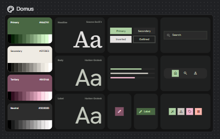

# Domus — Design System

Fonte da verdade visual do frontend. O board abaixo é o guia; a UI consome tokens, não hex solto.

Tokens em código: [`src/theme/tokens.ts`](../src/theme/tokens.ts). Tema MUI: [`src/theme/theme.ts`](../src/theme/theme.ts). Wordmark: [`src/assets/brand/domus-wordmark.svg`](../src/assets/brand/domus-wordmark.svg).

## Canvas

O modo de produto de referência é o **escuro** do board: Neutral 700, texto e cromo em Secondary 200, ênfase em Primary.

- Fundo: carvão profundo com **grid de pontos** branco, fino e de baixo contraste.
- Layout: **bento** — cards em grelha, padding interno generoso, gap regular entre blocos.
- Superfícies: um degrau mais claras que o canvas, borda sutil, canto largo.

## Marca

O logo de produto é o wordmark **DOMUS** em serifa de alto contraste. O ícone de paleta no canto do board é o frame do style guide, não substitui o wordmark.

Detalhes próprios:

- O **M** tem as diagonais internas cruzadas, com um losango no encontro.
- **M** e **U** compartilham a haste direita/esquerda (ligadura).
- Uma haste fina atravessa o centro do **U**.

| Arquivo | Uso |
| --- | --- |
| `src/assets/brand/domus-wordmark.svg` | Wordmark em `currentColor` |
| `src/assets/brand/domus-logo.svg` | Logo quadrado (creme + carvão) |
| `src/assets/brand/domus-mark.svg` | Marca compacta (M no quadrado creme) — favicon |
| `src/components/brand/DomusLogo.tsx` | Wordmark na UI |

Sobre superfície clara o wordmark usa Neutral `#2D2D2D`. Sobre superfície escura, Secondary `#EFEBE3`. Não recolorir o losango nem a ligadura com Primary.

## Paleta

Quatro âncoras. Cada uma tem 10 passos (50–900). A âncora de marca está marcada.

| Papel | Hex | Uso |
| --- | --- | --- |
| Primary | `#4A6741` | Sage, ação, ênfase, dados |
| Secondary | `#EFEBE3` | Creme: superfície clara, texto sobre dark |
| Tertiary | `#815166` | Ameixa: acento, ênfase secundária |
| Neutral | `#2D2D2D` | Carvão: chrome escuro, texto no claro, fundo dark |

Não inventar uma quinta cor de marca. Perigo (lixo, erro destrutivo) é semântico, não âncora.

### Primary

| 50 | 100 | 200 | 300 | 400 | 500 | **600** | 700 | 800 | 900 |
| --- | --- | --- | --- | --- | --- | --- | --- | --- | --- |
| `#F1F5EF` | `#DDE6DA` | `#C0D0BB` | `#A3B99C` | `#7D9A74` | `#5C7D54` | **`#4A6741`** | `#3A5234` | `#2B3D27` | `#1C281A` |

### Secondary

| 50 | 100 | **200** | 300 | 400 | 500 | 600 | 700 | 800 | 900 |
| --- | --- | --- | --- | --- | --- | --- | --- | --- | --- |
| `#FBF9F6` | `#F5F2EC` | **`#EFEBE3`** | `#E0D8C8` | `#C9BBA3` | `#A89474` | `#8A7554` | `#6B5A40` | `#4A3E2C` | `#2E261B` |

### Tertiary

| 50 | 100 | 200 | 300 | 400 | **500** | 600 | 700 | 800 | 900 |
| --- | --- | --- | --- | --- | --- | --- | --- | --- | --- |
| `#F7F1F3` | `#ECDFE4` | `#D6BCC7` | `#C090A3` | `#A0758B` | **`#815166`** | `#694152` | `#51323F` | `#38232C` | `#21151A` |

### Neutral

| 50 | 100 | 200 | 300 | 400 | 500 | 600 | **700** | 800 | 900 |
| --- | --- | --- | --- | --- | --- | --- | --- | --- | --- |
| `#F7F7F7` | `#EBEBEB` | `#D4D4D4` | `#B0B0B0` | `#8A8A8A` | `#5C5C5C` | `#404040` | **`#2D2D2D`** | `#1F1F1F` | `#141414` |

## Tipografia

| Papel | Família | Peso |
| --- | --- | --- |
| Headline | **Source Serif 4** | 400–600 |
| Body / UI / Label | **Hanken Grotesk** | 400–600 |

Títulos (`h1`–`h6`) usam Source Serif 4. Corpo, subtítulo, botão e label usam Hanken Grotesk. `textTransform` de botão permanece `none`.

## Forma

- Cards, inputs e superfícies: **12–16px**.
- Botões: **~12px**.
- Nav e busca largos: **pill** (canto cheio).
- Sombra, quando houver, tingida de Primary (`rgba(74, 103, 65, …)`).

## Componentes

Alvo visual do board no canvas escuro.

### Botões

| Variante | Fundo | Texto / borda |
| --- | --- | --- |
| Primary | sage claro (Primary 100–200) | Neutral 700 |
| Secondary | cinza escuro / translúcido | Secondary 200 |
| Inverted | branco | Neutral 700 |
| Outlined | transparente | texto e borda Secondary 200 |
| Icon + label | Primary 600 | ícone e label em Secondary 200 |

### Busca

Campo escuro, canto largo ou pill, ícone de lupa à esquerda, placeholder curto. Sem chrome extra.

### Navegação

Barra pill no chrome escuro, poucos ícones. Item ativo: quadrado arredondado em sage (Primary).

### Dados

Barras horizontais de ponta redonda. Três faixas de marca: Primary, Neutral, Tertiary. Sem quinta cor.

### Tiles de ícone

Quadrados arredondados nas âncoras (Primary, Neutral, Tertiary). Ação destrutiva usa o tom de **perigo** (salmão/laranja no board), não uma âncora nova.

## Mapeamento semântico (MUI)

Os nomes da paleta de marca não coincidem 1:1 com `palette.primary` / `palette.secondary` do MUI.

| Token MUI | Claro | Escuro |
| --- | --- | --- |
| `primary.main` | Primary 600 | Primary 600 |
| `primary.contrastText` | Secondary 200 | Secondary 200 |
| `secondary.main` | Tertiary 500 | Tertiary 400 |
| `background.default` | Secondary 200 | Neutral 700 |
| `background.paper` | `#FFFFFF` | `#363636` |
| `text.primary` | Neutral 700 | Secondary 200 |
| `text.secondary` | Neutral 500 | Neutral 300 |
| `divider` | Secondary 300 | `rgba(239, 235, 227, 0.12)` |

O esquema segue `prefers-color-scheme` (sem toggle nesta entrega).

## Tom

Escuro no board é o modo de produto de referência (Neutral 700 + creme + sage). O modo claro inverte superfícies para Secondary 200 e texto Neutral 700, mantendo as mesmas âncoras.
